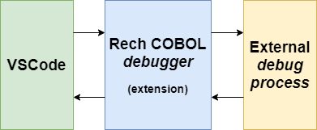

# Debug COBOL files with Visual Studio Code

This extension allows debugging COBOL files through VSCode along with an external command-line debugging process, mapping UI actions to commands on the external process.

The output of each command is captured from debugging process and shown on VSCode UI in many ways, like in Variable Watch or Hover.

## Configuration steps

It is suggested to use isCOBOL™ command-line debugger _isdbg_ since the commands fired by this extension respect the commands expected by _isdbg_.

You need to configure the location/command-line to start the external debugger, as follows:

    "rech.cobol.debug.commandline": "C:\\debugger\\isdbg.exe $1",

You can ask user for specific questions before external debugger is started. Each question corresponds to the respective index on command line:

    "rech.cobol.debug.commandline": "isdbg.exe $1 $2",
    "rech.cobol.debug.params": [
        "Program name",
        "Sample question for second parameter",
    ]

You can specify as many questions as needed.
